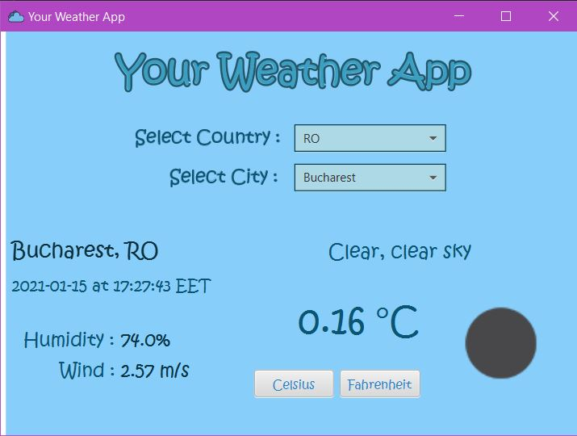

# Your Weather App 
 

## Description

Your Weather App aims to display weather data from different cities around the world at that point of time. The application is made using the Java programming language. The interaction with the user is done through the user interface. This was done using JavaFX packages.

## How does it work ?

The application uses a file that contains a list of cities and its characteristics extracted from the database of the OpenWeatherMap web application. First, a list is made of the countries in which the respective cities are located. The user has the possibility to choose a country, after which he can opt for a city from that country in the list. The weather data will be obtained following a request to the [OpenWeatherMap API](https://openweathermap.org/api) . The request contains the id of the respective city. For it, meteorological details will be displayed, such as air temperature or humidity.

Here is in image of user interface:
 

